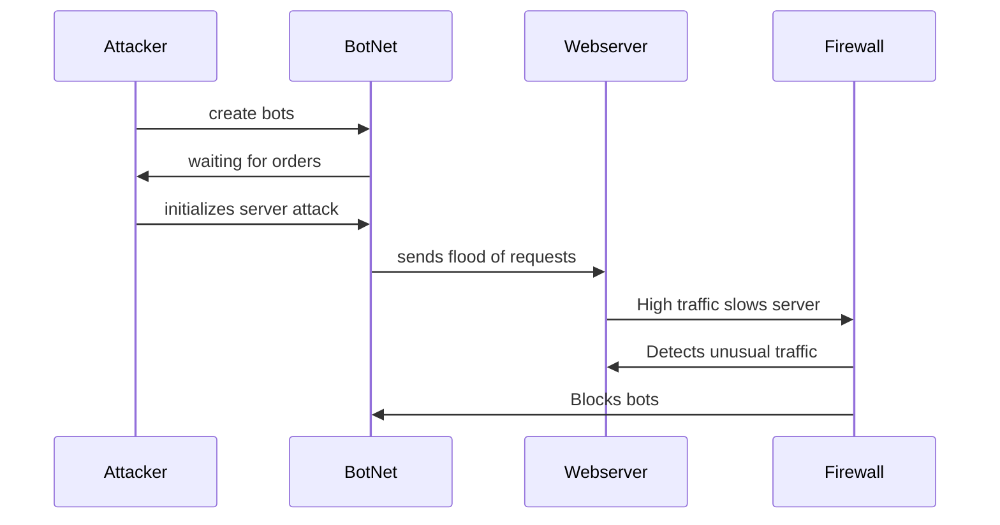

# This is a mermaid test

```mermaid
sequenceDiagram
    participant Attacker
    participant BotNet
    participant Webserver
    participant Firewall
    Attacker->>BotNet: create bots
    BotNet->>Attacker: waiting for orders
    Attacker->>BotNet: initializes server attack
    BotNet->>Webserver: sends flood of requests
    Webserver->>Firewall: High traffic slows server
    Firewall->>Webserver: Detects unusual traffic
    Firewall->>BotNet: Blocks bots
```
## Documentation
1. An Attacker creates bots through a bot net to carry out a cyberattack
2. Attacker initializes the attack once the bots are made
