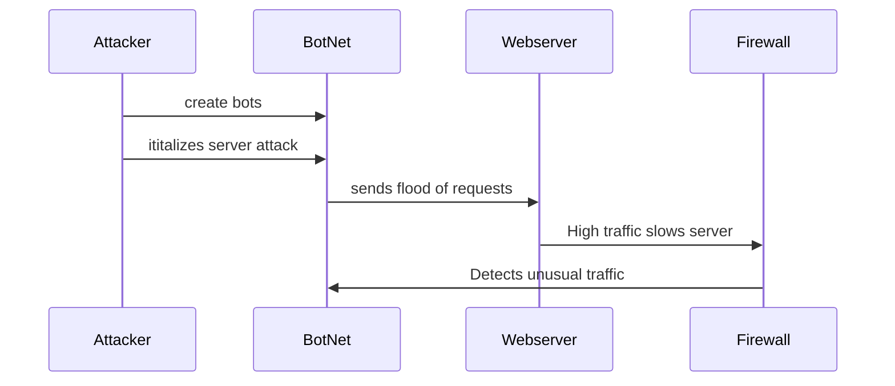

# This is a mermaid test

```mermaid
sequenceDiagram
    participant Attacker
    participant BotNet
    participant Webserver
    participant Firewall
    Attacker->>BotNet: create bots
    Attacker->>BotNet: ititalizes server attack
    BotNet->>Webserver: sends flood of requests
    Webserver->>Firewall: High traffic slows server
    Firewall->>BotNet: Detects unusual traffic
```
