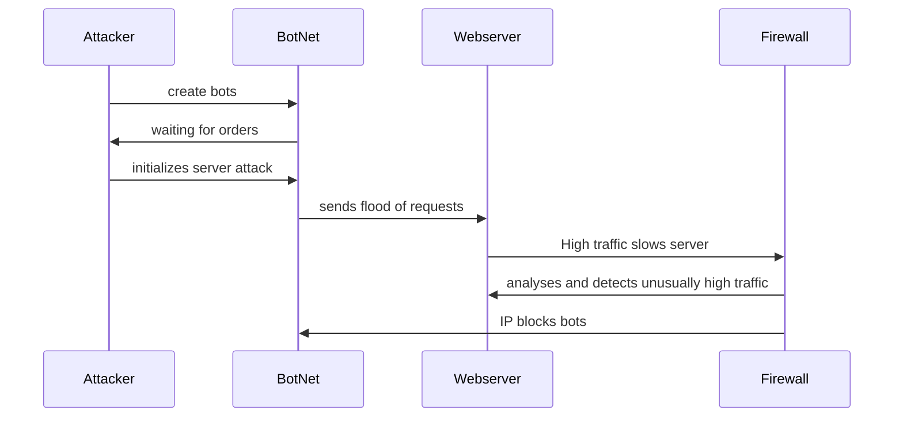

# This is a mermaid test

## Documentation
1. An Attacker creates bots through a bot net to carry out a cyberattack
2. Attacker initializes the attack once the bots are made
3. The BotNet floods the Webserver with bots that slow down the server
4. The unusually high traffic causes the firewall to respond
5. The firewall blocks the attackers robots by blocking out the source IP address and stops the attack
